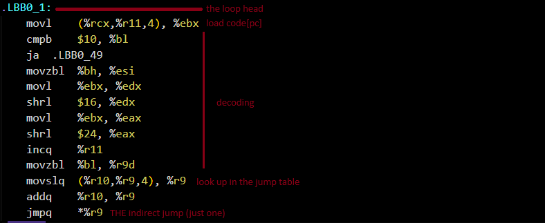
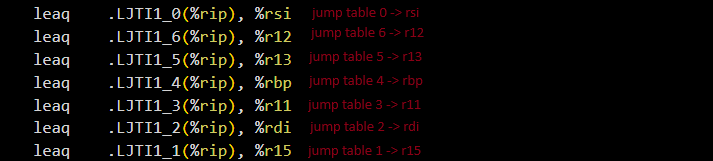

# Threaded Dispatch in Rust Without `goto`
## Tricking LLVM into it !

Write up by VBXQ (Haydar) 2026.

## The problem

If you've ever written an interpreter or a VM, you know the classic bottleneck: the dispatch loop

```rust
loop {
    match opcode {
        ADD => { ... }
        SUB => { ... }
        MUL => { ... }
        ...
    }
}
```

It's clean, readable, but it's slow \:(
    
Why? Because all opcodes share a single indirect jump. 

The CPU has an indirect branch predictor / BTB that tries to predict where `jmpq *%r9` will land, but since all 11 opcodes go through the same jump, the predictor gets destroyed every time the opcode changes.... misprediction after misprediction \:(

In C, the solution has existed for ages : computed gotos

```c
void *dispatch_table[] = { &&op_add, &&op_sub, &&op_mul, ... };
#define DISPATCH() goto *dispatch_table[*pc++]

op_add:
    regs[dst] = regs[a] + regs[b];
    DISPATCH();  // each handler has its own jump
op_sub:
    ...
```

Each handler ends with its own `goto *dispatch_table[opcode]`. So that means each indirect jump gets its own BTB entry, and the predictor learns local pattern, for example "after ADD, it's usually SUB" etc.

The problem: **Rust doesn't have computed goto.**..and it probably never will, that's not the language philosophy, and honestly it's essentially disguised `unsafe` and it breaks every guarantee the language tries to make.

## The idea

Here's the thing: what if we duplicated the entire `match` at the end of every handler?

Instead of jumping back to the loop after each opcode, we stick a full copy of the dispatch, so decode + match right after the handler work. If LLVM is smart enough, it should generate a distinct indirect jump for each copy. And then we've got our threaded dispatch.

The risk: LLVM has a pass called "tail merging" that detects when multiple code blocks end with the same sequence and merges them. If it kicks in, it glues all our duplicated matches back into one, and we're back to square one.

The question is: does it actually work?

## The implementation

The thing with Rust macros is that they're expanded at compile time. So if you write a `dispatch!()` that calls `goto_add!()` which calls `dispatch!()` again, you get infinite recursion and rustc blows up with "recursion limit reached"

Ask me how I know.

The solution is bounded unrolling. Instead of infinite recursion, we do N levels of inline dispatch, and the last level falls back into the outer `loop`.

Concretely, for 2 levels:

```rust
loop {
    let (op, dst, a, b) = exec_one!(code, regs, pc);
    match op {
        OP_ADD => {
            regs[dst] = regs[a].wrapping_add(regs[b]);
            // !! level 2: inline dispatch
            let (op2, dst2, a2, b2) = exec_one!(code, regs, pc);
            handle!(regs, pc, op2, dst2, a2, b2);
            // falls through to loop for level 3+
        }
        OP_DEC => {
            regs[dst] = regs[dst].wrapping_sub(1);
            let (op2, dst2, a2, b2) = exec_one!(code, regs, pc);
            handle!(regs, pc, op2, dst2, a2, b2);
        }
        // ... same for every opcode
    }
}
```

Each arm of the outer match contains its own copy of the decode + dispatch. So that gives us 11 copies of the match (one per opcode). LLVM sees 11 distinct switch statements, each preceded by a different handler.

I also made a 3-level version to see if it made a difference: each handler dispatches the next, which dispatches the next again, then back to the loop. That's 11 * 2 = 22 copies of the dispatch at the source level.

## The results

### Timing

```
        central-dispatch:  12780.7 ns/iter  (result = 333334000)
         threaded-2level:  10541.7 ns/iter  (result = 333334000)
         threaded-3level:   9959.4 ns/iter  (result = 333334000)
```

~17% faster for 2 levels, ~22% for 3 levels. All three versions produce the same result (333334000), so the logic is correct !

### The assembly, where it gets interesting

I built with:
rustc 1.93.0 (254b59607 2026-01-19)

```toml
[profile.release]
opt-level = 3
lto = "fat"
codegen-units = 1
```

Then `cargo rustc --release -- --emit=asm` to get the `.s` file.

#### `run_central` : classic dispatch

~243 lines of assembly. The core:



```asm
.LBB0_1:                          # the loop head
    movl   (%rcx,%r11,4), %ebx    # load code[pc]
    ...                            # decode
    movslq (%r10,%r9,4), %r9      # look up in the jump table
    addq   %r10, %r9
    jmpq   *%r9                    # THE indirect jump (just one)
```

And every handler:

```asm
.LBB0_25:   # ADD
    addq   ...
    jmp    .LBB0_1     # back to the loop

.LBB0_12:   # MUL
    imulq  ...
    jmp    .LBB0_1     # back to the loop

.LBB0_16:   # DEC
    decq   ...
    jmp    .LBB0_1     # back to the loop
```

**1 jump table** (`.LJTI0_0`), **1 indirect jump**, every handler does `jmp .LBB0_1` to go back to the center, just a classic dispatch pattern.

#### `run_threaded` : duplicated dispatch

~2170 lines of assembly. Already 9x bigger.. good sign!

The prologue is amazing, check this out :



LLVM preloaded **7 jump table addresses into dedicated registers**. It understood we'd use them a lot and hoisted them out of the loop. The remaining 4 are loaded with inline `lea`s where needed.

Now look at each handler:

```asm
.LBB1_39:   # ADD
    addq   ...
    movq   %rax, 32(%rsp,%rcx,8)    # write result
    movl   4(%r8,%r14,4), %ebx      # load code[pc+1] INLINE
    ...                               # decode
    leaq   .LJTI1_9(%rip), %r10     # ITS OWN jump table
    movslq (%r10,%r9,4), %r9
    jmpq   *%r9                      # ITS OWN indirect jump

.LBB1_28:   # DEC
    decq   32(%rsp,%rcx,8)
    movl   4(%r8,%r14,4), %ebx
    ...
    movslq (%r11,%r9,4), %r9        # uses .LJTI1_3 via r11
    jmpq   *%r9                      # ITS OWN indirect jump

.LBB1_49:   # JMPNZ
    cmpq   $0, 32(%rsp,%rcx,8)
    cmoveq %r10, %r14               # branchless: cmov instead of jmp
    movl   (%r8,%r14,4), %ebx
    ...
    movslq (%rdi,%r9,4), %r9        # uses .LJTI1_2 via rdi
    jmpq   *%r9                      # ITS OWN indirect jump
```

**Zero `jmp .LBB1_3`** (back to the loop) in the main handlers. Every handler ends with `jmpq *%r9` straight to the next handler

This means : **11 jump tables**, **11 indirect jumps**.. that's threaded dispatch in Rust, without computed goto !! 

#### The numbers

| | `run_central` | `run_threaded` | `run_threaded_deep` |
|---|---|---|---|
| Asm lines | ~243 | ~2,170 | ~4,210 |
| Jump tables | 1 | 11 | 21 |
| Indirect jumps | 1 | 11 | 21 |
| End of each handler | `jmp` to center | `jmpq *` to next handler | `jmpq *` to next handler |

## Why LLVM doesn't merge it all back

That was my big worry.. LLVM has a tail merging pass that's supposed to detect exactly this kind of duplication and eliminate it. So why doesn't it fire here?

I tested this experimentally instead of guessing:

**So, test 1: Disabling tail merging entirely.** I compiled with `-tail-merge-threshold=0` which turns off the tail merger completely. The resulting assembly is byte-for-byte identical to the normal build. The tail merger simply never fires here, the preconditions for merging aren't met.

```bash
RUSTFLAGS="-C llvm-args=-tail-merge-threshold=0" cargo rustc --release -- --emit=asm
# diff against normal build: identical output
```

**And test 2: Adding bounds checks back.** I replaced `get_unchecked` with normal `$code[$pc]` indexing (which inserts bounds check sequences) and recompiled from clean. The dispatch structure is **unchanged**: still 1/11/21 jump tables, still 1/11/21 indirect jumps. The functions grow by ~30 lines of assembly but the dispatch doesn't degrade.

So why doesn't the tail merger fire? It's because the code preceding each dispatch copy is different enough (ADD does `addq`, MUL does `imulq`, DEC does `decq`, etc.) that LLVM never sees identical tails to merge. The live registers and scheduling constraints differ at each merge point, and that's enough.

I originally thought `get_unchecked` was load-bearing for preventing merging, turns out that's wrong, the dispatch structure survives bounds checks just fine lol.

## Reading the assembly yourself

Build it:

```bash
cargo rustc --release -- --emit=asm
```

The assembly lands in `target/release/deps/vm_dispatch_bench*.s`. Search for `run_central`, `run_threaded`, `run_threaded_deep` to find each function.

If you're not used to reading x86-64, here's a cheat sheet:

| Pattern | What it means |
|---------|---------------|
| `leaq .LJTIx_y(%rip), %reg` | Loading a jump table address |
| `jmpq *%reg` | Indirect jump through table, **this is the dispatch** |
| `.LJTIx_y:` followed by `.long` entries | Jump table data |
| `jmp .LBBx_y` (no `*`) | Direct jump back to loop head, central dispatch |

## What I take away from this

1. **It technically works!!** Duplicating the match at the end of each handler produces real threaded dispatch in the assembly generated by LLVM.

2. **The speedup is real.** 15-22% on a program doing trivial operations (add, mul, sub). On a real interpreter with heavier opcodes, the relative dispatch improvement would be smaller, but in the hot loop of a VM it matters.

3. **But it's not free.** The generated code is... ~10x bigger. On a real interpreter you could run into icache problems. ughh.. 
The 3-level version is sometimes slower than 2-level because of this, branch prediction gains get eaten by icache misses.

4. **2 levels is the sweet spot.**, the 3rd level adds marginal gain and doubles code size. I'd recommend sticking with 2 levels of inline dispatch

5. **Not a replacement for computed goto lol.** In C with `goto *table[op]`, each handler has exactly one indirect jump and the code stays compact, here we're multiplying code size to get the same effect.

That was a nice experience

By the way, I'm currently writing my own programming language called [Aelys](https://github.com/vbxq/aelys_lang), with a couple of features that are relatively interesting, I would love if you could check it out ! 

## Credits

This small write up would not have been possible without [Keggek](https://codeberg.org/gek), thank you! 

## Reproducing

```bash
git clone <this repo>
cargo run --release                       # benchmark
cargo rustc --release -- --emit=asm       # assembly
# look at target/release/deps/vm_dispatch_bench*.s
```

## Down the rabbit hole: when renaming a crate changes performance by 40%

After writing all of the above, I renamed the crate from `vm-dispatch-bench` to `rust-goto`.. Same code, same Cargo.toml, same rustc. But the threaded dispatch suddenly became slower than central dispatch ??

After a lot of investigation, here's what happened:

### Some numbers

```
With crate name "vm-dispatch-bench" + lto="fat":
        central-dispatch:  12471.6 ns/iter
         threaded-2level:  10477.7 ns/iter   (~16% faster)
         threaded-3level:   8949.2 ns/iter   (~28% faster)

With crate name "rust-goto" + lto="fat":
        central-dispatch:   7492.9 ns/iter   ← 40% faster out of nowhere
         threaded-2level:  10143.7 ns/iter   (barely changed)
         threaded-3level:   8987.1 ns/iter   (barely changed)
```

The threaded versions are stable across both builds (~10400 and ~9000 ns). It's the central dispatch that went from 12400 to 7500, a **40% speedup from just changing the crate name**.

### What's going on

I diffed the assembly of `run_central` between both builds. And **it's instruction-for-instruction identical.** LLVM generated the exact same code. The only difference is that two small unrelated functions (`__rust_begin_short_backtrace` and a `Display::fmt` impl) appear in a different order in the binary, which shifts the starting address of `run_central` by a few dozen bytes.

And... that's it. The central dispatch hot loop, specifically the `jmpq *%r9` instruction, lands at a different virtual address, which changes how it aliases in the BTB. On my Zen 3, one address happens to be a sweet spot for the BTB, the other isn't. Same code, different address, 40% performance difference lol.

The threaded version is immune to this because its 11 indirect jumps are spread across ~2000 lines of assembly, it doesn't depend on one single jump landing on a good address.

### Without LTO, threaded wins regardless

```
Without LTO (opt-level = 3 only):
        central-dispatch:  12170.3 ns/iter
         threaded-2level:   7736.5 ns/iter   (~36% faster)
         threaded-3level:   9421.7 ns/iter   (~23% faster)
```

Without LTO, the alignment lottery doesn't happen and threaded dispatch wins consistently. LTO changes the layout of the final binary enough to trigger the alignment effect.

### The takeaway

If you're benchmarking anything with tight indirect jump loops, **alignment matters more than you think**. A crate rename, adding an unrelated function, or even changing a string literal can shift code layout and swing performance by double-digit percentages. It doesn't mean the technique is broken, it means micro-benchmarks are fragile. The assembly-level proof that LLVM produces real threaded dispatch (11 distinct jump tables, 11 distinct indirect jumps) stands regardless of what the timers say on any particular binary layout. Anyway, thanks for reading all of that ! Take care.


## License

BSD 3-Clause License
